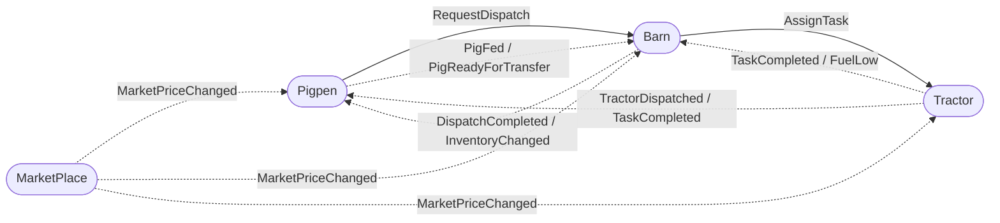

# AnimalHaus

AnimalHaus is a distributed farm simulator example built on .NET 8 and ZeroMQ.

## Projects

- `src/systems/AnimalHaus.Pigpen`
- `src/systems/AnimalHaus.Barn`
- `src/systems/AnimalHaus.Tractor`
- `src/systems/AnimalHaus.MarketPlace`
- `src/tools/AdministrationApp`
- `src/shared/AnimalHaus.Shared.Core`
- `src/shared/AnimalHaus.Shared.Utils`
- `src/shared/AnimalHaus.Shared.Messaging`
- `src/contracts/AnimalHaus.Contracts`
- `tests/AnimalHaus.Shared.Tests`
- `tests/AnimalHaus.Integration.Tests`

## System Overview

Four independent .NET 8 processes communicate over ZeroMQ using PUB/SUB events (dashed arrows) and REQ/REP commands (solid arrows):

You can use the cross-platform Avalonia `AdministrationApp` tool to coordinate and monitor endpoint configuration for these systems.



## Run

```bash
dotnet build AnimalHaus.sln
dotnet test AnimalHaus.sln
```

Then run each system in a separate terminal:

```bash
dotnet run --project src/systems/AnimalHaus.Pigpen/AnimalHaus.Pigpen.csproj
dotnet run --project src/systems/AnimalHaus.Barn/AnimalHaus.Barn.csproj
dotnet run --project src/systems/AnimalHaus.Tractor/AnimalHaus.Tractor.csproj
dotnet run --project src/systems/AnimalHaus.MarketPlace/AnimalHaus.MarketPlace.csproj
```

Or launch all systems together:

```bash
./launch.sh
```

For a high-traffic congestion profile (heavy crosstalk, especially Barn/MarketPlace), use:

```bash
./launch-congestion.sh
```

You can tune the congestion launcher with:

- `ANIMALHAUS_CONGESTION_TICK_INTERVAL_MS` (default `25`)
- `ANIMALHAUS_CONGESTION_MAX_TICKS` (default `400`)
- `ANIMALHAUS_CONGESTION_STARTUP_DELAY_MS` (default `50`)

See `docs/architecture.md` and `docs/message-contracts.md` for the system topology and message conventions.
